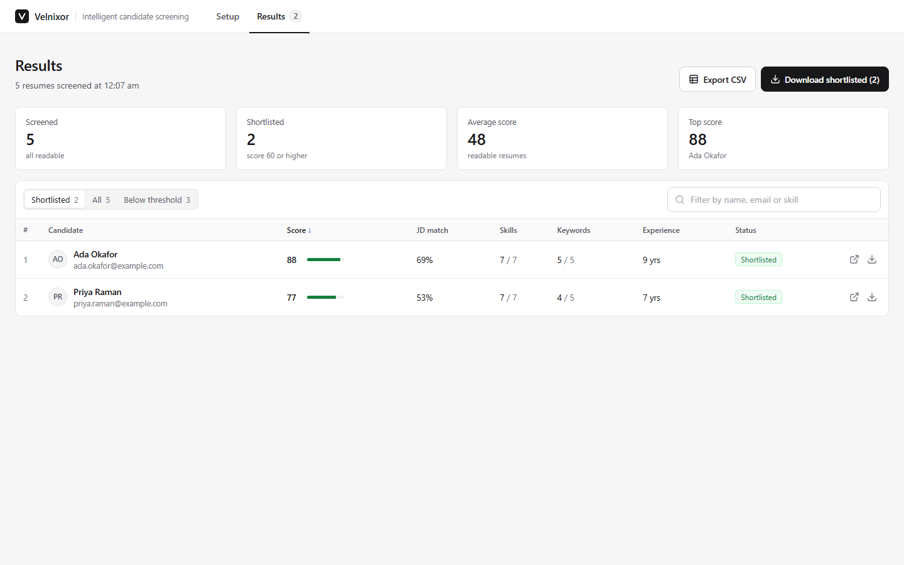
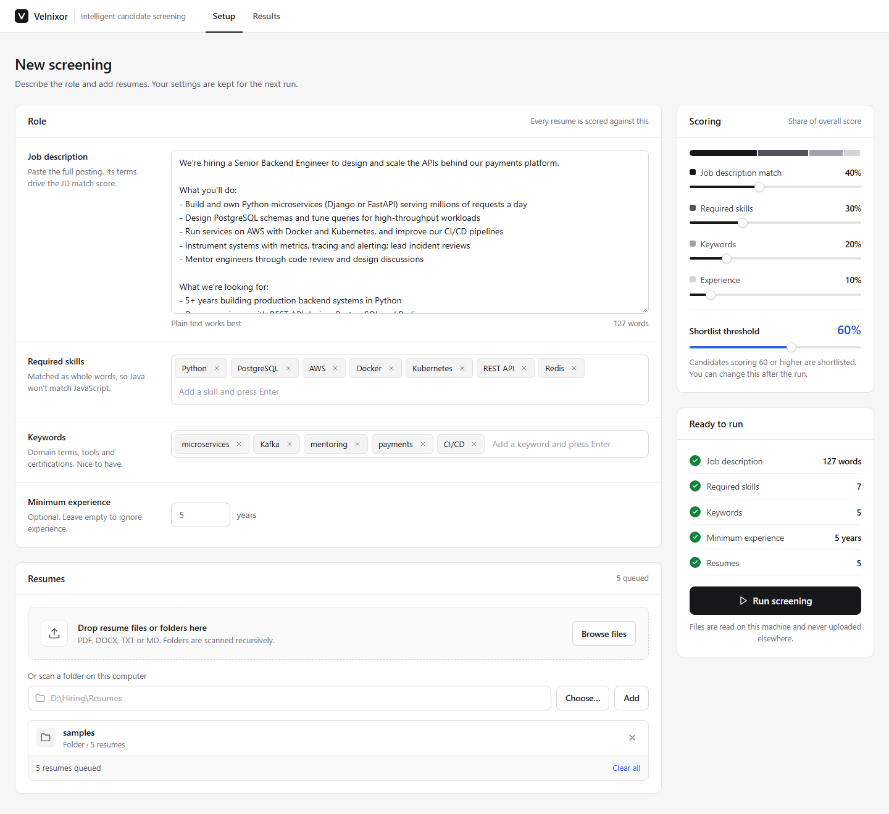
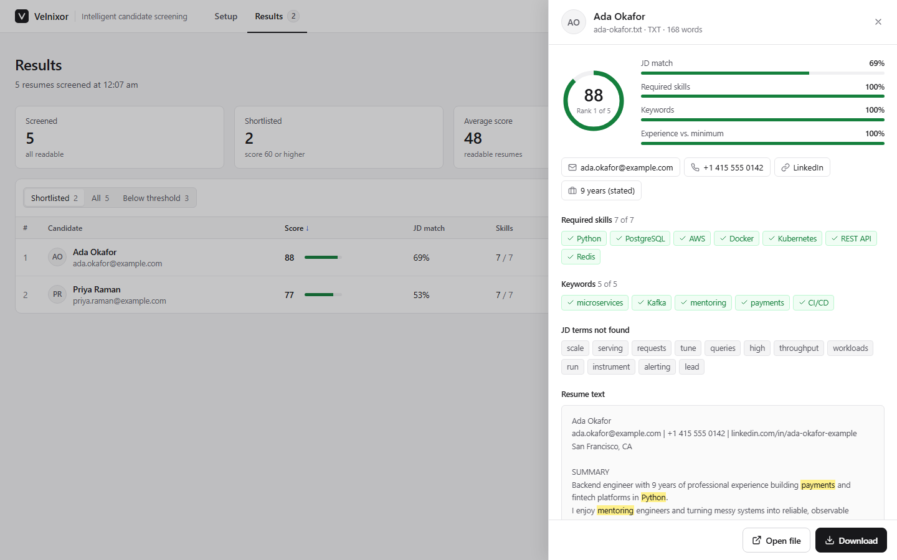
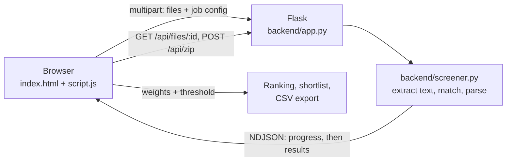

# Velnixor

**Intelligent candidate screening.** A self-hosted tool that reads a stack of resumes, scores each one against a job description, and gives you a ranked shortlist with the reasons behind every score.




## Contents

- [Why Velnixor](#why-velnixor)
- [Features](#features)
- [Quick start](#quick-start)
- [Using the app](#using-the-app)
- [How scoring works](#how-scoring-works)
- [Architecture](#architecture)
- [HTTP API](#http-api)
- [Security and privacy](#security-and-privacy)
- [Project structure](#project-structure)
- [Limitations](#limitations)
- [Development](#development)
- [Contributing](#contributing)
- [License](#license)

## Why Velnixor

The first pass of hiring is slow and repetitive. Someone opens every PDF, looks for the must-have skills, works out years of experience from job dates, and decides who is worth a call. For a role with a few hundred applicants that is a day of work, and the decisions are hard to explain afterwards.

Velnixor does that first pass for a whole folder in about a minute:

- Every candidate gets the same checks against the same criteria.
- Every score can be traced back: which skills matched, which were missing, what the resume actually says.
- Recruiters spend their time on the shortlist, not on the pile.

It runs entirely on your machine. Resumes are personal data, so there is no cloud service, no third-party API and no account to create. Files are read locally and the server only listens on `127.0.0.1`.

## Features

**Input**
- Upload PDF, DOCX, TXT and Markdown resumes, drag and drop whole folders, or scan a local folder recursively by path
- Duplicate files are detected by content hash and skipped
- Scanned PDFs with no text layer are flagged instead of failing the batch

**Scoring**
- Four signals: job description match, required skills, keywords and years of experience
- Adjustable weights and shortlist threshold; the ranking updates instantly, without re-reading any file
- Whole-word skill matching that handles `C++`, `Node.js`, `CI/CD` and multi-word skills

**Review**
- Results table with search, filters (shortlisted, all, below threshold) and sortable columns
- Candidate panel with a score breakdown, matched and missing skills, important job description terms the resume lacks, and the resume text with matches highlighted
- Automatic extraction of name, email, phone, LinkedIn and total experience

**Output**
- Export every candidate, ranked, to CSV (opens cleanly in Excel)
- Download all shortlisted resumes as one ZIP, with original file names

## Quick start

**Requirements:** Python 3.11 or newer. Developed and tested on Windows 11; macOS and Linux should work the same way.

```bash
git clone https://github.com/Saiharshith007/velnixor.git
cd velnixor

python -m venv .venv
.venv\Scripts\activate           # Windows (PowerShell)
# source .venv/bin/activate      # macOS / Linux

pip install -r requirements.txt
python backend/app.py
```

The app opens in your browser at **http://127.0.0.1:8080**. Keep the terminal open while you use it and press `Ctrl+C` to stop.

To use another port:

```bash
PORT=9000 python backend/app.py            # macOS / Linux
$env:PORT=9000; python backend/app.py      # Windows PowerShell
```

The **Choose…** folder picker uses Tkinter, which ships with the python.org installers. On Debian or Ubuntu install it with `sudo apt install python3-tk`. Typing the folder path works without it.

## Using the app

### 1. Setup



- **Role**: paste the job description, then add required skills and keywords (press Enter or comma after each). Set a minimum experience if it matters for the role.
- **Resumes**: drop files or folders, click **Browse files**, or type a folder path and click **Add**.
- **Scoring**: set how much each signal counts. Weights are relative; the bar shows each signal's share of the overall score.
- **Ready to run**: a checklist of what you have filled in. **Run screening** unlocks once there is at least one resume and one requirement.

Everything on this tab except the resumes is saved in the browser and restored next time.

To try it with demo data, type `samples` in the folder field and paste the job description from [`samples/role.json`](samples/role.json). The five resumes in that folder are fictional.

### 2. Results

When the run finishes the app switches to the **Results** tab, filtered to the shortlist. The cards at the top summarise the batch; the table ranks every candidate. Use the filters, search and column headers to slice it.

Changing a weight or the threshold on the Setup tab re-ranks the results immediately. If you change the job description, skills or keywords, a banner asks you to run the screening again, because those are checked against the files.

### 3. Candidate details



Click any row to see why the candidate scored what they did. The original file can be opened or downloaded from here.

## How scoring works

Each signal produces a score from 0 to 100.

| Signal | How it is calculated |
| --- | --- |
| **JD match** | The job description is split into terms. Stop words and numbers are dropped and plurals are folded (`systems` = `system`). Each term is weighted by how often the JD repeats it (`1 + ln(count)`). The score is the weighted share of those terms found in the resume. |
| **Required skills** | The share of listed skills found in the resume as whole words, case-insensitive, with optional plural. `Java` does not match `JavaScript`; `REST API` matches `REST APIs`. |
| **Keywords** | Same method as required skills. Use it for nice-to-haves such as domains, tools and certifications. |
| **Experience** | Years found ÷ minimum required, capped at 100. Only counts when a minimum is set. |

The overall score is the weighted average of the signals that apply:

```
overall = Σ (weight × score) / Σ weight      (signals with no input are left out)
```

A candidate is shortlisted when `overall ≥ threshold`. With the default weights (40 / 30 / 20 / 10), the top sample candidate scores:

```
(40 × 69 + 30 × 100 + 20 × 100 + 10 × 100) / 100 = 87.6  →  88
```

**Experience detection** tries two methods in order:

1. An explicit statement such as `8+ years of experience` or `Total experience: 5 years`. The largest value wins.
2. Otherwise, employment date ranges such as `Jan 2019 – Present`, `2018 - 2021` or `03/2020 to 06/2023`. Overlapping jobs are merged so concurrent roles are not double counted, and lines that mention a university, degree or GPA are skipped.

The candidate panel shows which method was used, for example `9 years (stated)` or `7.7 years (from job dates)`.

## Architecture



A few decisions worth knowing about:

- **The weighted score is computed in the browser.** The server returns the four signal scores per resume. Weights and the threshold are applied client-side, so tuning them is instant and never re-reads a file.
- **Progress is streamed.** `/api/screen` returns newline-delimited JSON: one event per file as it is read, then a final event with all results. The progress bar reflects real work, not a timer.
- **No build step.** The frontend is plain HTML, CSS and JavaScript. Icons are inlined SVG, so the app works offline.
- **Three dependencies.** `flask`, `pdfplumber` and `python-docx`. Scoring uses only the standard library and is deterministic: the same input always gives the same output.
- **Stateless between runs.** Uploaded files go to a temporary folder that is deleted when the server stops. File IDs live in memory, so restarting the server invalidates old download links.

## HTTP API

All endpoints are served from `127.0.0.1` and are intended for the bundled UI.

| Method | Path | Body | Response |
| --- | --- | --- | --- |
| `GET` | `/` | | The app |
| `POST` | `/api/scan` | `{"path": "D:/Resumes"}` | `{"count": 23}`, or `404` if the path does not exist |
| `POST` | `/api/browse` | | `{"path": "..."}` from a native folder picker |
| `POST` | `/api/screen` | multipart: `files` (repeatable) and `config` (JSON) | NDJSON event stream, see below |
| `GET` | `/api/files/<id>` | `?download=1` to force download | The original resume file |
| `POST` | `/api/zip` | `{"ids": ["..."]}` | ZIP of the requested files |

`config` for `/api/screen`:

```json
{
  "jd": "We're hiring a Senior Backend Engineer...",
  "skills": ["Python", "PostgreSQL"],
  "keywords": ["payments"],
  "paths": ["D:/Hiring/Backend-2026"]
}
```

Events:

```json
{"type": "progress", "done": 0, "total": 5, "file": "ada-okafor.pdf"}
{"type": "done", "duplicates": 0, "results": [{
  "id": "4f9c…", "name": "ada-okafor.pdf", "format": "PDF", "error": null, "words": 168,
  "candidate": "Ada Okafor", "email": "ada.okafor@example.com", "phone": "+1 415 555 0142", "linkedin": "linkedin.com/in/…",
  "jd_score": 69, "jd_missing": ["scale", "throughput"],
  "skills": {"matched": ["Python"], "missing": []}, "keywords": {"matched": [], "missing": ["payments"]},
  "experience_years": 9.0, "experience_source": "stated", "text": "…"
}]}
```

## Security and privacy

Velnixor is a single-user tool for your own machine. Within that scope:

- The server binds to `127.0.0.1` only, so nothing else on the network can reach it.
- Requests whose `Host` header is not `localhost` or `127.0.0.1` are rejected, which blocks DNS-rebinding attacks.
- Requests with an `Origin` from another site are rejected, so a web page you visit cannot make Velnixor scan folders or open dialogs.
- Files can only be fetched by the random ID issued during a run, never by path.
- Uploaded file names are sanitised before they touch the disk, and requests are capped at 200 MB.
- All resume text is HTML-escaped before rendering, and CSV cells are guarded against spreadsheet formula injection.
- Uploads live in a temporary directory that is removed on exit.

**Do not expose it to the internet as is.** It has no authentication, it shares one in-memory file registry between all users, folder scanning reads the host's disk, and it runs on Flask's development server. A hosted version would need a different design.

## Project structure

```
velnixor/
├── backend/
│   ├── app.py            Flask server: routes, uploads, folder scan, streaming, downloads
│   └── screener.py       Text extraction, matching, experience and contact parsing
├── frontend/
│   ├── index.html        Single page with Setup and Results tabs
│   ├── css/style.css
│   └── js/script.js      UI state, client-side scoring, results table, candidate panel
├── samples/              Fictional resumes and a sample job (role.json)
├── docs/screenshots/     Images used in this README
├── requirements.txt
└── LICENSE
```

## Limitations

- **Matching is lexical.** Synonyms are not linked: `k8s` does not match `Kubernetes`, and `ML` does not match `machine learning`. Add both forms as skills if it matters.
- **Scanned PDFs need OCR first.** Image-only PDFs have no text layer and are flagged as unreadable.
- **Heuristics can miss.** Experience, name and phone detection are pattern based. Unusual resume layouts may need a manual check, which the candidate panel makes quick.
- **English stop words.** JD matching works for other languages, but common words in those languages are not filtered out.
- **A screening aid, not a decision maker.** Automated hiring tools are regulated in some places (for example NYC Local Law 144 and the EU AI Act). Keep a human in the loop and review how you use the scores.

## Development

```bash
python backend/screener.py    # self-checks for parsing and scoring
python backend/app.py         # run the app
```

There is no frontend build and no bundler: edit the files in `frontend/` and refresh the page.

Some pointers for common changes:

- **New file format:** add the extension to `SUPPORTED` and a branch to `extract_text()` in `backend/screener.py`, and update the `accept` list and `SUPPORTED` pattern in the frontend.
- **New scoring signal:** compute it per resume in `screen()` (`backend/screener.py`), then add it to `score()` and a weight slider in the frontend.
- **Matching rules:** `term_regex()` for skills and keywords, `tokens()` and `STOPWORDS` for JD matching.

## Contributing

Issues and pull requests are welcome.

1. Fork the repository and create a branch from `main`.
2. Keep changes focused. Avoid new dependencies unless they clearly pay for themselves.
3. Run `python backend/screener.py` and check the app end to end with the sample data.
4. For UI changes, include a before and after screenshot in the pull request.

## License

[MIT](LICENSE)
